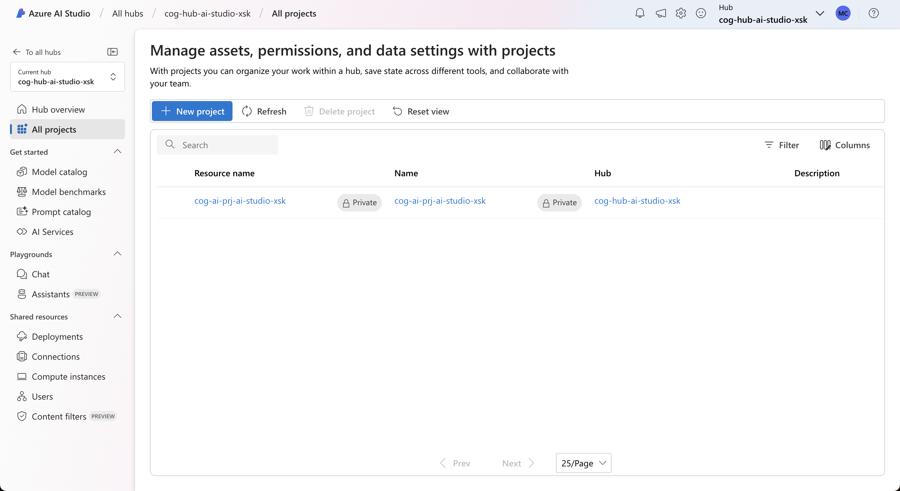
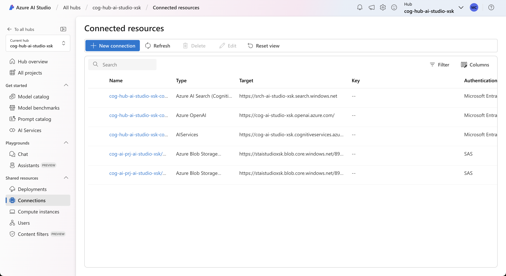

# AI-in-a-Box - Azure AI Studio Secure Quickstart

|||
|:---| ---:|
|This solution is part of the the AI-in-a-Box framework developed by the team of Microsoft Customer Engineers and Architects to accelerate the deployment of AI and ML solutions. Our goal is to simplify the adoption of AI technologies by providing ready-to-use accelerators that ensure quality, efficiency, and rapid deployment.|  |

## User Story

Azure AI Studio allows you to manage and deploy AI and ML solutions across the enterprise with centralized security and compliance controls, while sharing compute and cognitive service resources among different projects and use cases.

Common workloads that can be implemented with AI Studio include:

- Retrieval-Augmented Generation (RAG) chatbots that can retrieve and reason over your own data and documents
- Open-source and proprietary model deployments, with either Batch or Online endpoints
- Quality and performance experiments for AI workloads, based on the Azure AI Evaluator Catalog

## What's in the Box


- Simple Azure AI Studio setup following Microsoft's best practices for security and access management
- Managed Network integration which allows AI projects to leverage resources behind customer-managed vNets
- Fine-grained access control allowing services to communicate amongst each other with minimal privileges
- Template project including:
  - Azure Open AI deployment (gpt-4o)
  - Azure App Services deployment
  - Quality and Content Safety Evaluations
- Sample documents for RAG implementation
  
## Thinking Outside of the Box

The solution can be adapted for your own use cases:

- Add custom documents as a data source to implement RAG over your own data;
- Customize and deploy the RAG inference process through Prompt Flow;
- Create a custom evaluation suite that guarantees the quality of responses before deploying a new model version

You may also further customize the template to hook into existing network and security resources, such as a hub-and-spoke model or next-generation firewall.

## Deploy the Solution

### Prerequisites for running locally:
1. Install latest version of [Azure CLI](https://docs.microsoft.com/en-us/cli/azure/install-azure-cli-windows?view=azure-cli-latest)
2. Install latest version of [Bicep](https://docs.microsoft.com/en-us/azure/azure-resource-manager/bicep/install)
3. Install latest version of [Azure Developer CLI](https://learn.microsoft.com/en-us/azure/developer/azure-developer-cli/install-azd)

### Deploy to Azure

1. Clone this repository locally
```
git clone https://github.com/Azure-Samples/ai-studio-in-a-box
```
2. Deploy resources

```
cd ai-studio-in-a-box
azd auth login
azd env new
azd up
```

You will be prompted for an environment name, a subscription, location and a few other customization parameters. **The location must be a region that supports GPT-4o** - for example, East US 2.

### Post deployment

After deployment, you should see two new resource groups.

**rg-dns**: Contains required Private DNS Zones to enable private endpoint name resolution within the vNet. 


**rg-{environment-name}**: Contains all other resources, including AI Hub, connected services and private endpoints.


If you deployed with restricted network access, make sure to enable your IP through the firewalls in the following services:

- Azure AI Hub;
- Azure AI Search;
- Azure AI Services;
- Storage Account.

Alternatively, you can provision up a jumphost on the vNet created to gain access without opening firewall exceptions. 

As part of the deployment process, two shared private links are created so that AI Search can privately reach Blob Storage and AI Services. Before you continue, make sure to approve the private endpoint connections on both AI Services and Storage Account. 


## Run the Solution

Go to the [AI Studio](https://ai.azure.com) and choose your Hub resource.

Verify that you can:

- Create new Projects

- Create deployments

- Add Service Connections

- Add new Compute Instances

- Grant access to Hub and Projects


Below is a basic RBAC structure recommended for the created resources:

| Role               | Resource | Description |
| ----               | -------  | ----------- |
| Owner              | Hub      | Creates and grants access to new resources, service connections and compute |
| Contributor        | Hub      | Creates and grants access to new AI Projects |
| Azure AI Developer | Hub      | Develops, evaluates and deploys AI models shared across projects |
| Reader             | Hub      | Read access over all AI Projects |
| Owner              | Project  | Manages access to existing AI Project |
| Contributor        | Project  | Creates project-specific resources, such as web applications and cognitive services |
| Azure AI Developer | Project  | Develops, evaluates and deploys AI models within the project scope |
| Reader             | Project  | Read access over single AI Project |

## Customize the Solution

### Simple RAG chat application

Follow the steps below to deploy a simple RAG chat application using the provisioned resources

1. Deploy GPT-4o with at least 10k TPM quota


2. Open the new deployment in the Chat Playground


3. Select Add your data, then select a project. Use the project deployed along with the template.


4. This will put you in the Project view. Select Add your data and then Add a new data source


5. Use the Upload Files option and upload a PDF file. You may use one of your own, or the sample file from this link: [Contoso Benefits](https://github.com/Azure-Samples/cognitive-services-sample-data-files/blob/master/openai/contoso_benefits_document_example.pdf)


> Note: if the upload fails, make sure you have both network and RBAC access to the storage account. If you were missing either, it may take a few minutes to update. Log out and back in if necessary.

6. Set up index settings


7. Set up search settings


8. Click create to begin the indexing process


> Note: If you get an error message regarding private endpoints in this step, it could mean either AI Services or AI Search is unreachable. Ensure your own IP is allowed on both their firewall settings, or that you are using a jumphost with access to private endpoints.

9. Wait for the process to complete and test the web chat


10. Deploy to a web app


> Note: Deploying to a Web App requires Contributor access to the resource group, and Application Developer on the Microsoft Entra scope. You will also need to configure the Azure Open AI Service Connection to use API Keys.

11. Once the Web App deployed, remove the AZURE_OPENAI_KEY environment variable in order to use RBAC authorization (recommended)


12. Also make sure the AZURE_SEARCH_RESOURCE and AZURE_SEARCH_INDEX variables are populated with the appropriate values, and that AZURE_SEARCH_KEY is not added.


13. Grant Cognitive Services Open AI User access to the App Service system identity


14. If you enabled chat history, go to the Cosmos DB resource, disable public network access and create a private endpoint.


15. Create a vNet integration on the App Service to allow it to reach the private endpoints. 


16. Finally, test the web app to verify it successfully connects to the underlying services.


17. Optionally, restrict inbound network access to the app.

### Prompt Flow

You can customize the on-your-data resource by using Prompt Flow. Once the playground is configured with a data source, use the Prompt Flow option to create an inference pipeline that can be further configured.


### Evaluations

Evaluations are coming soon!

## How to Contribute

This project welcomes contributions and suggestions. Most contributions require you to agree to a Contributor License Agreement (CLA) declaring that you have the right to, and actually do, grant us the rights to use your contribution. For details, visit <https://cla.opensource.microsoft.com>

When you submit a pull request, a CLA bot will automatically determine whether you need to provide a CLA and decorate the PR appropriately (e.g., status check, comment). Simply follow the instructions provided by the bot. You will only need to do this once across all repos using our CLA.

This project has adopted the [Microsoft Open Source Code of Conduct](https://opensource.microsoft.com/codeofconduct/). For more information see the [Code of Conduct FAQ](https://opensource.microsoft.com/codeofconduct/faq) or contact <opencode@microsoft.com> with any additional questions or comments.
## Key Contacts & Contributors

Highlight the main contacts for the project and acknowledge contributors. You can adapt the structure from AI-in-a-Box:

| Contact | GitHub ID | Email |
|---------|-----------|-------|
| Marco Cardoso | @MarcoABCardoso | macardoso@microsoft.com |

## Acknowledgments

Special thanks to:

- Chris Ayers (@codebytes)
- Jean Hayes (@jehayesms)
- Andres Padilla (@AndresPad)
- Neeraj Jhaveri (@neerajjhaveri)

## License

This project may contain trademarks or logos for projects, products, or services. Authorized use of Microsoft trademarks or logos is subject to and must follow [Microsoft's Trademark & Brand Guidelines](https://www.microsoft.com/en-us/legal/intellectualproperty/trademarks/usage/general). Use of Microsoft trademarks or logos in modified versions of this project must not cause confusion or imply Microsoft sponsorship. Any use of third-party trademarks or logos are subject to those third-party's policies.

## FAQ

1. Compute instance setup fails with StorageMountError:
   ```commandline
    StorageMountError: The specified Azure ML Compute Instance ******** setup failed with error "Failed to mount storage. Details - Hint:If you're using network security group rules, make sure to allow outbound connection to ports 443, 445 for storage service tag. For more details please visit aka.ms/AMLComputeVnet"
   ```
    - Compute instances are unable to mount for the first time with identity-based access. If you require compute instances, first deploy with key-based access, create one compute, and later switch to identity based. After this process, you will be able to create new computes normally.

2. InvalidPrincipalId: A valid principal ID must be provided for role assignment.
    - Some versions of AZD CLI will not run the preup hook when running `azd up` for the first time. Make sure to initialize the environment with `azd env new` before running `azd up`, or simply redeploy to fix this issue.

3. BadRequest: When updating a shared private link resource, only 'requestMessage' property is allowed to be modified
    - After the first time you deploy shared private links, subsequent deployments will fail with this message. Run the command below to disable the re-deployment of shared private links.
    ```sh
    azd env set AZURE_DEPLOY_SHARED_PRIVATE_LINKS false
    ```

4. ValidationError: Managed network cannot be disabled once enabled.
    - Same as above for AI Projects. Run the command below to disable the re-deployment of the AI Project.
    ```sh
    azd env set AZURE_DEPLOY_AI_PROJECT false
    ```

---

This project is part of the AI-in-a-Box series, aimed at providing the technical community with tools and accelerators to implement AI/ML solutions efficiently and effectively.
